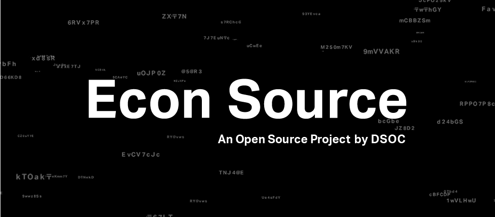

    

# Concept
Econ Source is a project that combines the free spirit of Open Source Software, the rigurosity of Economics and the practicality of Data Science.
We believe that many interesting real-life challenges can be solved through the methods of Economics but many obstacles still remain for it to become mainstream.
This project is about working together for removing those obstacles, and to expand the boundaries of Economics beyond academia and into the real world for the benefit of everyone.
It is based on four principles:

### Share
We share our code for everyone to use it freely under the Apache 2.0 license.
We welcome contributions, and we are open to bug reports, feature requests, and look forward to hearing about your use cases.
Feel free to use the libraries here for your personal research, study or work.

### Build
Done is better than perfect, and what you'll find here is just done.
We hope for active participation from researchers, data scientists, students, people in the academia, the industry, and specially anyone who shares this vision.
We aim for high-quality software that is at the same time easy to understand and to contribute to.
We encourage test-oriented development, and the usage of best practices in software development.

### Discuss
We appreciate and encourage polite and constructive discussion.

### Learn
One of the best things about Open Source is that everyone makes each other better.
We aim to maintain easy-to-read code from which anyone willing to learn can find a hint.
Papers in Empirical Economics can sometimes be very shallow regarding the implementation details of algorithms.
Did you ever want to see a code implementation of an algorithm, but the paper is not very detailed about it? Check the unit tests or the source code here, maybe you'll find a clue.
Have you thought of contributing to an open source project but don't know where to start? Well, what about here?

# Working together

In DSOC we see great value in each encounter.
We hope that *Econ Source* can become the starting point for collaboration, be it software development, empirical research or business.
There are many opportunities to collaborate with us:

### Through Code
If you have a bug report or feature request, fill an Issue stating the name of the library. We appreciate your code contributions as well.
See the README file on each library for details about details on developing, testing, code conventions, etc.

### Collaborative Research
*Sansan Data Discovery* is our collaborative research platform. Learn more about it [here](https://en.sansan-dsoc.com/research/datadiscovery/).

To know more about the kind of research we perform at DSOC, check our [Data Science Reports](https://sansan-dsoc.com/research/report/) (only in Japanese).

 
